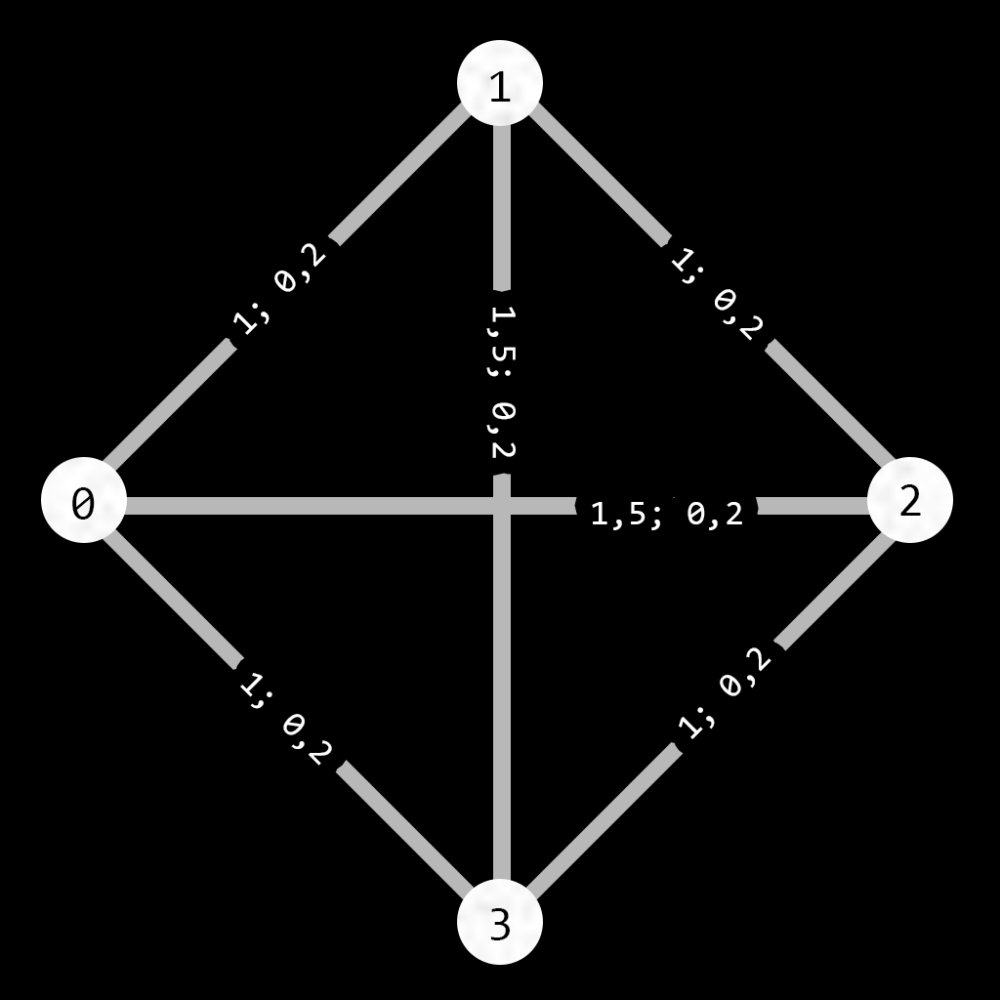
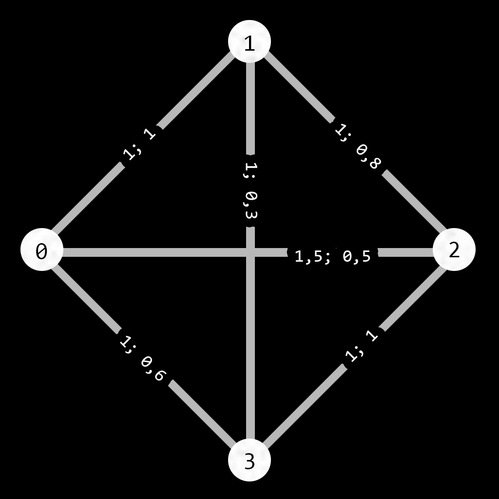
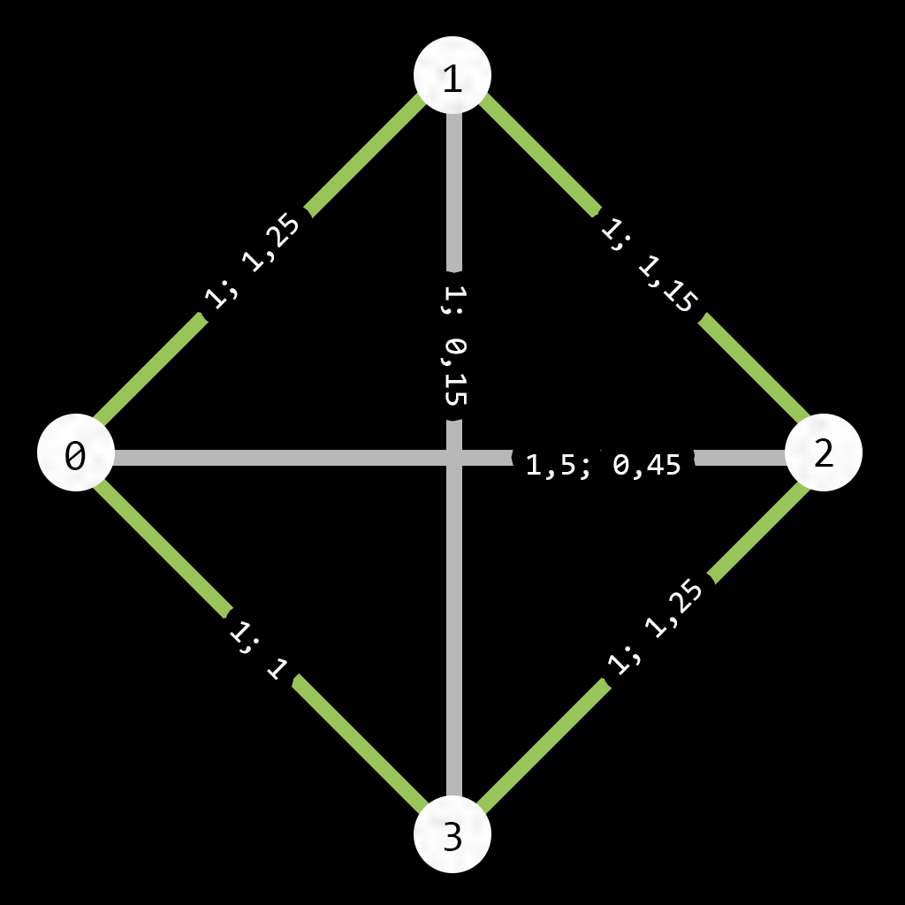

## Муравьиный алгоритм
Подготовил Гуля Пётр

Муравьиный алгоритм - алгоритм нахождения приближённого решения задачи коммивояжёра.
Алгоритм подражает поведению настоящих муравьёв, как бы запуская по пути муравьёв, которые бегают и оставляют феромон на пути своего следования, тем больше, тем короче путь, а уже другие муравьи, выбирая свой следующий путь ориентируются на этот феромон, чаще выбирая тот путь где его больше.

#### Это всё хорошо, но зачем так мудрить?
Чтоб ответить на этот вопрос давайте просто подумаем как долго будет перебрать все возможные пути для графа размером n?
Давайте разбирается:
Для первой вершины у нас есть n-1 возможных вариантов пути, для следующей уже n-2, далее n-3 и так пока не дойдём до нуля. То есть выходит, что нам надо рассматривать $(n-1)!$ путей? Всё-таки не совсем. Задача коммивояжёра симметричная, а значит, можно рассмотреть всего $\frac{(n-1)!}{2}$ и вроде кажется, что можно выдыхать, но нет, давайте посмотрим сколько вариантом надо будет рассмотреть для разных n:

|  n  | кол-во вариантов |
| :-: | :--------------: |
|  4  |        3         |
|  5  |        12        |
|  6  |        60        |
|  7  |       360        |
|  8  |       2520       |
|  9  |      20160       |
| 10  |      181440      |
| 11  |     1814400      |
| 12  |     19958400     |
| 13  |    239500800     |
| 14  |    3113510400    |
| 15  |   43589145600    |

И тут мы приходим к факту, что уже для всего 66 вершин задача практически нерешаема перебором, а часто мы хотим рассмотреть значительно больше вершин.

#### Зачем мне эти ваши компутеры, я и сам всё могу! 

Что интересно, человек очень просто решает множество очевидных задач коммивояжёра приходя к близкому к идеальному решение просто взглянув на схему и прикинув возможные пути. Но, во-первых, нам нужно эту схему нарисовать, расположить все расстояния и графически показать цену перехода, а во-вторых, это не интересно!

#### Давайте потрошить алгоритм!

Первым делом нам нужно завести две матрицы. Первая, которую обзовём $\tau$ будет хранить все матрицу смежности для всех вершин, а вторая - $\eta$ будет хранить в себе кол-во феромона на переходе из вершины в вершину.

Далее нужен цикл, а точнее даже два цикла, ведь в сути своей кол-во муравьёв ($N$) это сколько раз нам нужно запустить алгоритм поиска пути до изменений феромона.

Пускаем муравьёв. И они никуда не двигаются... А потому что они не знают куда! А для этого уже нужна формула, которая **будет определят шанс перехода из вершины в вершину**, а так же госпожа Удача, которая милостиво даст нам число от 0 до 1. Нам же остаётся взглянуть на формулу:

$$P_{k; i,j} = \frac {{\frac{1}{\eta}}^\alpha_{i,j} \cdot \tau_{i,j} ^ \beta}{\sum_m {\frac{1}{\eta}}^\alpha_{m} \cdot \tau_{m} ^ \beta}$$

 Где $\alpha$ и $\beta$ - константы
Переводя с математического на русский тут сказано, что шанс перейти из вершины i в j для муравья k равен обратному расстояния в степени бета умноженному на кол-во феромона в степени альфа, делённому на сумму всех таких множеств.
Таким образом получаем, что чем меньше расстояния от i к j, и чем больше феромона лежит от i к j, то тем больше шанс, что муравей выберет этот путь.

Итак мы выбрали путь, и прошли его, и даже запомнили его длинную как $L_k$, а сам путь в множество $T_k$, как мы будем менять феромон? А тут тоже всё просто и подлежит простым формулам. Итак формула **вклада феромона от муравья k** будет такой:

$$\Delta\tau_{k; i,j} = \begin{cases} \frac{Q}{L_k} \text{ если } i, j \in T_k; \\ 0 \text{ если } i,j \notin T_k; \end{cases}$$

 Где Q - константа.
Это формула обозначает, что муравей k на каждый из путей по которому он прошёл будет класть феромон в кол-во равном его Q делённом на его путь.

Также надо добавить **испарение феромона**, чтобы система была динамичной. Для этой, как ни странно, тоже есть своя формула: 

$$\tau_{i,j} = \rho \tau_{i,j} + \sum^N_{k=0} \Delta\tau_{k; i,j}$$

Где $\rho$ - константа
Фактически эта формула означает, что кол-во феромона между i,j после прохода всех муравьёв будет равно его кол-во с прошлой итерации плюс сумма всех вкладов муравьёв. Логично предположить, что здесь $\rho$ должно быть в диапазоне от 0 до 1.

И всё! Эти 3 формулы описывают весь алгоритм, так что давайте разберём его на простом примере:

#### Компилируем код на листочке, пример: 
Пусть у нас будут 4 вершины, 4 муравья, а все константы, кроме $\rho$  будут равны 1, чтобы о них забыть, $\rho$ же будет равно 0,5.

Итак, да будет матрица смежности!

|     | 0   | 1   | 2   | 3   |
| --- | --- | --- | --- | --- |
| 0   | 0   | 1   | 1,5 | 1   |
| 1   | 1   | 0   | 1   | 1,5 |
| 2   | 1,5 | 1   | 0   | 1   |
| 3   | 1   | 1,5 | 1   | 0   |

И конечно же не забудем про матрицу феромонов, там назначит начальным значением 0,2

|     | 0   | 1   | 2   | 3   |
| --- | --- | --- | --- | --- |
| 0   | 0   | 0,2 | 0,2 | 0,2 |
| 1   | 0,2 | 0   | 0,2 | 0,2 |
| 2   | 0,2 | 0,2 | 0   | 0,2 |
| 3   | 0,2 | 0,2 | 0,2 | 0   |

Всё это выходит в такой красивый граф:



- Пускам первого муравья, пусть его путь будет 0 -> 1 -> 2 -> 3 -> 0 и его длинна будет равна 4. Тогда на каждое ребро он положит $\frac{1}{4} = 0,25$  феромона. 
- Второй пройдёт по пути 1 -> 3 -> 2 -> 0 -> 1 его путь уже будет равен 5 и на каждое ребро уже он положит 0,2 феромона
- У третьего путь: 2 -> 3 -> 1 -> 0 -> 2, длинна 5, феромона 0,2
- Ну и у четвёртого 3 -> 2 -> 1 -> 0 -> 3, длинна 4, феромона 0,25

Самое время обновлять таблицу феромонов:
Каждое значение надо умножить на 0,5; таким образом 0,2 станет 0,1 и к каждому надо будет прибавить посчитанные ранее значения. Не буду это расписывать, лучше покажу результат:

|     | 0   | 1   | 2   | 3   |
| --- | --- | --- | --- | --- |
| 0   | 0   | 1   | 0,5 | 0,6 |
| 1   | 1   | 0   | 0,8 | 0,3 |
| 2   | 0,5 | 0,8 | 0   | 1   |
| 3   | 0,6 | 0,3 | 1   | 0   |

И следовательно граф становиться таким:



Уже на этом этапе видно что намечается очевидный фаворит более короткого пути, но при этом так выпал случай, что 0-3 ребро имеет мало феромона. В любой случае, предлагаю посмотреть ещё один шаг:
- Первый: 0 -> 3 -> 2 -> 1 - > 0, путь 4, вклад 0,25
- Второй  1 -> 3-> 0 -> 2 -> 1, путь 5, вклад 0,2
- Третий 2 -> 3 -> 0 -> 1 -> 2, путь 4, вклад 0,25
- Четвёртый 3->2->1->0->3, путь 4, вклад 0,25

Матрица:

|     | 0    | 1    | 2    | 3    |
| --- | ---- | ---- | ---- | ---- |
| 0   | 0    | 1,25 | 0,45 | 1    |
| 1   | 1,25 | 0    | 1,15 | 0,15 |
| 2   | 0,45 | 1,15 | 0    | 1,25 |
| 3   | 1    | 0,15 | 1,25 | 0    |

Граф


И тут уже очевиден фаворит по длине пути.

#### А можно лучше?
Муравьиный алгоритм существует уже очень давно и поэтому оброс разными улучшениями. Здесь нет цели вдаваться в их подробности, но заострю внимание на улучшении  c "элитными" муравьями: такие ходят только по лучшему пути, что значит, что на такой путь каждый цикл добавляется феромон, что заставляет следующих муравьёв чаще искать путь, который как-то изменяет прошлый наилучший
#### Код, мне нужен код!

Осталось немного. Написать код который делает решает этот алгоритм. Я написал его на C# под Unity  полный код найдёте по [этой ссылке](vk.com). А тут же покажу код самого алгоритма с подробными комментариями:
```csharp
// Объявление переменных для алгоритма муравьиной колонии
private float alpha, beta, Q, ro, startPheromone, minPheromone; // Параметры алгоритма
private int antCount = 1; // Количество муравьев
private int eliteAntCount = 0; // Количество элитных муравьев
private int iteration = 0; // Счетчик итераций
private float pathSize = 0.0f; // Длина лучшего найденного пути

private float[,] adjMatrix; // Матрица смежности графа
private float[,] pheromoneMatrix; // Матрица феромонов

// Структура для представления муравья
public struct Ant
{
    public int currentPoint { set; get; } // Текущая позиция муравья
    public bool[] visitedPoints { set; get; } // Массив посещенных точек
    public int visitedPointsCounter; // Счетчик посещенных точек
    public List<int> path; // Путь, пройденный муравьем
    public float pathLength; // Длина пути
    public bool isElite; // Флаг, указывающий, является ли муравей элитным

    // Конструктор для инициализации муравья
    public Ant(int point, int adjMatrixLength, bool Elite)
    {
        this.currentPoint = point; // Установка текущей точки
        this.visitedPoints = new bool[adjMatrixLength]; // Инициализация массива посещенных точек
        this.visitedPointsCounter = 0; // Инициализация счетчика
        this.path = new List<int>(); // Инициализация списка пути
        this.pathLength = 0.0f; // Инициализация длины пути
        this.isElite = Elite; // Установка флага элитности
    }
}

// Метод, вызываемый при старте
void Start()
{
    // Получение матрицы смежности из контроллера графа
    adjMatrix = graphController.GetAdjMatrix();
    if (adjMatrix.Length == 0) return; // Если матрица пуста, выходим из метода

    // Инициализация матрицы феромонов
    pheromoneMatrix = new float[adjMatrix.GetLength(0), adjMatrix.GetLength(1)];
    for (int x = 0; x < pheromoneMatrix.GetLength(0); x++)
    {
        for (int y = 0; y < pheromoneMatrix.GetLength(1); y++)
        {
            // Установка феромонов на диагонали в 0 (муравей не может вернуться в ту же точку)
            if (x == y) pheromoneMatrix[x, y] = 0;
            else pheromoneMatrix[x, y] = startPheromone; // Установка начального значения феромонов
        }
    }

    // Запуск основного цикла алгоритма
    StartCoroutine(Main());
}

// Основной метод алгоритма
private IEnumerator Main()
{
    int vertexCount = adjMatrix.GetLength(0); // Количество вершин в графе
    float minLength = float.MaxValue; // Минимальная длина пути
    List<int> bestPath = new List<int>(); // Лучший найденный путь
    int startVertex = 0; // Начальная вершина

    // Бесконечный цикл для итераций алгоритма
    while (true)
    {
        // Матрица для добавления феромонов
        float[,] pheromoneAdd = new float[pheromoneMatrix.GetLength(0), pheromoneMatrix.GetLength(1)];
        
        // Цикл по количеству муравьев
        for (int antNum = 0; antNum < antCount; antNum++)
        {
            // Создание нового муравья
            Ant ant = new Ant(startVertex % vertexCount, vertexCount, antNum >= (antCount - eliteAntCount));
            startVertex++; // Переход к следующему муравью
            
            // Цикл, пока муравей не посетит все вершины
            for (; ant.visitedPointsCounter < vertexCount; ant.visitedPointsCounter++)
            {
                if (!ant.isElite) // Если муравей не элитный
                                {
                    float sum = 0.0f; // Переменная для хранения суммы вероятностей
                    List<int> possible = new List<int>(); // Список возможных вершин для перехода

                    // Цикл по всем вершинам для нахождения возможных переходов
                    for (int i = 0; i < vertexCount; i++)
                    {
                        // Пропускаем уже посещенные вершины и текущую вершину
                        if (ant.visitedPoints[i] || i == ant.currentPoint) continue;

                        // Вычисляем вероятность перехода к вершине i
                        sum += Mathf.Pow(pheromoneMatrix[ant.currentPoint, i], alpha) * Mathf.Pow(1.0f / adjMatrix[ant.currentPoint, i], beta);
                        possible.Add(i); // Добавляем вершину в список возможных
                    }

                    // Если нет возможных переходов, добавляем текущую точку в путь и выходим из цикла
                    if (possible.Count == 0)
                    {
                        ant.path.Add(ant.currentPoint);
                        break;
                    }

                    // Генерируем случайное число для выбора следующей вершины
                    float randomPoint = Random.Range(0.0f, 1.0f);
                    float marker = 0.0f; // Переменная для накопления вероятностей
                    int nextPoint = possible[0]; // Начальное значение следующей точки

                    // Цикл по возможным вершинам для выбора следующей точки
                    foreach (int point in possible)
                    {
                        // Если накопленная вероятность превышает случайное число, выбираем эту точку
                        if (marker >= randomPoint)
                        {
                            nextPoint = point;
                            break;
                        }
                        // Накопление вероятности
                        marker += Mathf.Pow(pheromoneMatrix[ant.currentPoint, point], alpha) * Mathf.Pow(1.0f / adjMatrix[ant.currentPoint, point], beta) / sum;
                    }

                    // Обновляем длину пути и добавляем следующую точку в путь
                    ant.pathLength += adjMatrix[ant.currentPoint, nextPoint];
                    ant.path.Add(ant.currentPoint);
                    ant.visitedPoints[ant.currentPoint] = true; // Отмечаем текущую точку как посещенную
                    ant.currentPoint = nextPoint; // Переходим к следующей точке
                }
                else // Если муравей элитный
                {
                    // Устанавливаем путь и длину пути как лучший найденный
                    ant.path = bestPath;
                    ant.pathLength = minLength;
                }
            }

            // Вычисляем изменение феромонов на основе длины пути
            float deltaTau = Q / ant.pathLength;
            // Обновляем матрицу феромонов на основе пройденного пути
            for (int i = 0; i < ant.path.Count; i++)
            {
                pheromoneAdd[ant.path[i], ant.path[(i + 1) % ant.path.Count]] += deltaTau; // Добавляем феромоны для ребра
                pheromoneAdd[ant.path[(i + 1) % ant.path.Count], ant.path[i]] += deltaTau; // Добавляем феромоны для обратного ребра
            }

            // Если текущая длина пути меньше минимальной, обновляем минимальную длину и лучший путь
            if (ant.pathLength < minLength)
            {
                minLength = ant.pathLength; // Обновляем минимальную длину
                bestPath = ant.path; // Обновляем лучший путь
            }
        }

        // Обновляем матрицу феромонов с учетом испарения и добавления новых феромонов
        for (int x = 0; x < pheromoneMatrix.GetLength(0); x++)
        {
            for (int y = 0; y < pheromoneMatrix.GetLength(1); y++)
            {
                // Обновляем значение феромонов с учетом испарения и добавления новых
                pheromoneMatrix[x, y] = Mathf.Max(pheromoneMatrix[x, y] * ro + pheromoneAdd[x, y], minPheromone);
            }
        }

        // Ждем следующего кадра перед продолжением
        yield return null;
    } 
}

```

#### А если я сам хочу?
Ну и кончено я хочу дать каждому попробовать разные параметры для данного алгоритма, поэтому ниже вы можете интерактивно попробовать разные параметры и найти лучшие для своего графа: https://arcado-vol2.github.io/ant-algorithm-unity/

А если вы с телефона....

Ye
